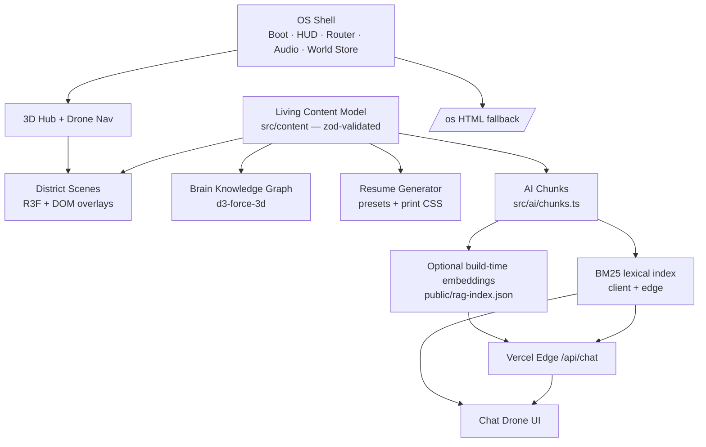

# High-Level Design — Nexus Sandbox

Status: v1.0 · Owner: autonomous build · Related: ADR-001…007, `PRINCIPLES.md`, `PROFILE.md`

## 1. System overview

Nexus Sandbox is a single-page web application plus one serverless edge function. It presents
Mohammad Heydari as an explorable digital twin: a 3D hub world with eight content districts, an
evidence-grounded AI assistant, and a deterministic multi-preset resume generator — all fed by
one validated content model.

## 2. Runtime topology

| Component             | Where it runs                            | Notes                                       |
| --------------------- | ---------------------------------------- | ------------------------------------------- |
| SPA (React 19 + Vite) | Browser, static hosting on Vercel CDN    | Three.js chunk lazy-loaded behind Suspense  |
| `/api/chat`           | Vercel Edge runtime                      | Retrieval + optional OpenAI call; stateless |
| Embedding build       | CI/build machine (`npm run build:index`) | Optional; output is a static JSON asset     |

There is no database and no server state. User progress (power %, achievements, terminals) is
persisted in `localStorage` via Zustand's persist middleware.

## 3. Core flows

### 3.1 Entry and exploration

1. Boot sequence (skippable terminal animation) → mode select (Guided Tour / Explorer / `/os` link).
2. Hub world loads lazily: drone avatar (keyboard + quick-travel bar), instanced skyline,
   portals for 8 districts, 5 hidden terminals.
3. Approaching or quick-traveling to a portal opens the district overlay (Radix dialog, lazy
   component). Closing returns to the hub; visiting raises world power; power drives skyline
   emissive intensity, particle brightness, and the audio pad filter.

### 3.2 AI assistant

1. Client tries `POST /api/chat` with the question.
2. Edge function retrieves top chunks (BM25; embeddings if the static index exists and a key is
   set), applies an answerability gate, then either calls OpenAI (persona guardrails, citations
   required) or returns retrieval-only cards.
3. If the API is unreachable (local dev without `vercel dev`), the client falls back to the same
   BM25 retrieval bundled in the app — identical evidence, no generation.

### 3.3 Resume generation

Preset (audience) → deterministic projection of the content model (facet-weighted bullet
selection, verbatim facts) → print-optimized CSS → browser "Print to PDF". No LLM in the path.

## 4. Key decisions (see ADRs)

- **ADR-001** single Vite app with path-aliased module boundaries, not a monorepo.
- **ADR-002** stack: React 19, R3F/drei/postprocessing, Zustand, Tailwind 4, Radix, Framer
  Motion, Lenis, Zod. Procedural WebAudio instead of audio assets.
- **ADR-003** hub + districts world model; Guided and Explorer modes; `/os` fallback route.
- **ADR-004** living content system: single source of truth with `sourceRefs` on every entity.
- **ADR-005** three-layer AI degradation: edge LLM → edge retrieval-only → local retrieval.
- **ADR-006** deterministic resume presets, print CSS, no generated facts.
- **ADR-007** Vercel deploy, GitHub Actions CI.

## 5. Quality attributes

| Attribute     | Mechanism                                                                                                    |
| ------------- | ------------------------------------------------------------------------------------------------------------ |
| Performance   | Lazy 3D chunk, manual vendor chunking, instancing, adaptive DPR, software-GL degradation, non-blocking fonts |
| Accessibility | `/os` full-content route, keyboard quick-travel, reduced-motion support, axe-tested (0 serious/critical)     |
| Correctness   | Zod validation at module load; unit tests on content, presets, retrieval; 40 E2E tests                       |
| Security      | Strict CSP + headers on Vercel, no secrets in client, input length caps on chat                              |
| Honesty       | Every rendered claim carries `sourceRefs`; "learning" skills capped and labeled; AI refuses without evidence |

## 6. Out of scope for v1 (documented in roadmap)

Multiplayer presence, real vector DB, LLM resume polish, WebGPU renderer, CMS-driven content
editing (stages 5–8 of the evolution ladder).
